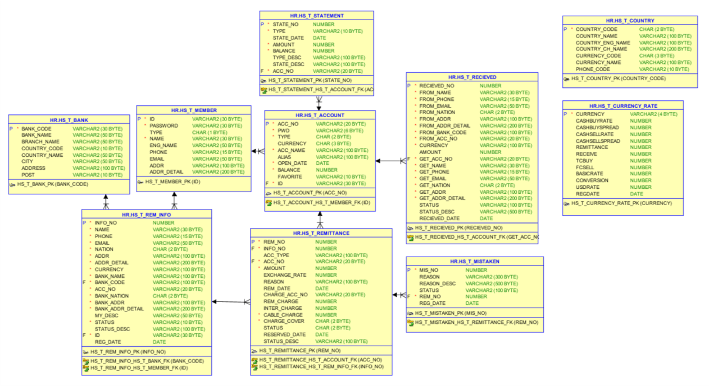

# 프로젝트 제목

[프로젝트 홈페이지 - https://koposoftware.github.io/2020_16_dyyoon/](https://koposoftware.github.io/2020_16_dyyoon/)

# 1. 프로젝트 개요

  
HanaSafe는 기존 하나은행의 해외송금에서 착오송금을 예방하고, 해결할 수 있는 기능을 추가하여 개선한 서비스이다. 빠르게 증가하는 해외송금시장에서 은행들은 새로운 해외송금 서비스를 선보이고 있고, 해외송금전문 업체들도 증가하고 있다. 시장 플레이어가 많아진 상황에서 서비스는 더욱 간편해지고 있으나, 그만큼 착오송금 또한 늘고 있는 추세이다. HanaSafe는 그렇게 해외송금 과정에서 착오송금을 예방하고 해결하기 위해 One-Stop 송금정보 입력(수취인 입력 + 선심사), 해외송금 전용 착오송금 신고 서비스를 추가하여 고객들에게 안전한 해외송금 과정을 제공한다. 

# 2. 프로젝트 제안서

## 2-1. 발표 자료	
[HanaSafe 해외송금 제안서](/윤다영_HANASAFE해외송금_제안서.pdf) 
## 2-2. 시스템 아키텍쳐 및 ERD
 
 

 

# 3. 프로젝트 결과

## 3-1. 발표 자료 
   [발표자료 pdf](/윤다영_HANASAFE해외송금_발표.pdf) 
    

## 3-2. 시연 동영상 

   
  <iframe src="https://www.youtube.com/embed/POMcV9qG9ak" frameborder="0" allow="accelerometer; autoplay; clipboard-write; encrypted-media; gyroscope; picture-in-picture" allowfullscreen></iframe>
   
## 3-3. HanaSafe 프로젝트 요약
 
### 수행기간
2020.09.02 ~ 2020.10.05
 
### 담당 업무
HanaSafe 설계 및 제작, 코딩
 
### 사용기술
Spring MVC 기반 웹 애플리케이션 제작 
Spring Locale 한국어, 영어, 중국어 3개 언어 지원 
Javaxmail, Thymeleaf 템플릿 형태 이메일 전송 
WebSocket 기반 실시간 알림 
Window Task Scheduler, Python 환율 정보 크롤링 
Spring Scheduler 기반 예약 송금 
계좌, 거래내역 입력 Transaction 
 
### 개발 환경
JDK 1.8, Window10, Oracle 11g express, Tomcat9
 
### Language / Tool / DB
 
Language : HTML, CSS, Javascript, Python, Java
Framework : Spring, MyBatis, Bootstrap, WebSocket
Database : Oracle DBMS
Server : Tomcat
Etc : Git(Git Bash)
 
### 요구사항
 
1.	사용자 
     1-1. 회원가입 
     1-2. 로그인 
2.	해외송금 
     2-1. 송금정보 조회/등록 
     2-2. 해외송금 전체 조회 
     2-3. 해외송금 보내기 
 2-4. 해외송금 예약하기 
 2-5. 착오송금 조회/신고 
3.	환율 
 3-1. 환율 조회 
 3-2. 송금 시 환율 계산 
4.	계좌 
 4-1. 계좌 조회 
 4-2. 거래내역 조회 
5.	관리자(은행원) 
 5-1. 송금정보 승인 
 5-2. 보내는 해외송금 승인 
 5-3. 받은 해외송금 승인 
 5-4. 착오송금 승인 
 
 
### 기대효과
HanaSafe를 통해 해외송금 시 발생하는 착오송금을 줄여 그 사이에 발생하는 비용을 절감하고 동시에 사회적 이미지를 구축할 수 있어 고객 증대에 도움이 될 것으로 기대한다. 
 
### 보완점
1.BankCodesAPI의 은행코드 – 은행 정보 API 접근 불가, DB에 데이터 PROTOTYPE 형태 삽입
2.GCP, AWS deploy 계획
3.외환 업무에 대한 정확한 프로세스 파악 후 관리자단 개선 필요
 

# 4. 본인 소개

|이름 |윤다영||
|연락처 | dayoung927(@)gmail.com|
|skill set| Frontend - HTML, CSS, Javascript|
| | Backend - Java, Spring, Oracle|
|자격증| SQLD  |
|수상| 통신분야 빅데이터 플랫폼 아이디어 경진대회 일반부 대상 |
|특기사항|  TOEIC 975, HSK 6급 |

 
